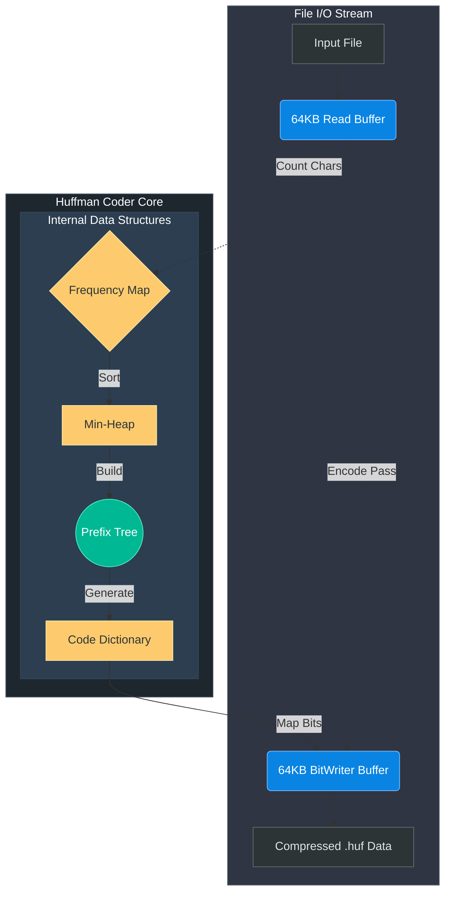
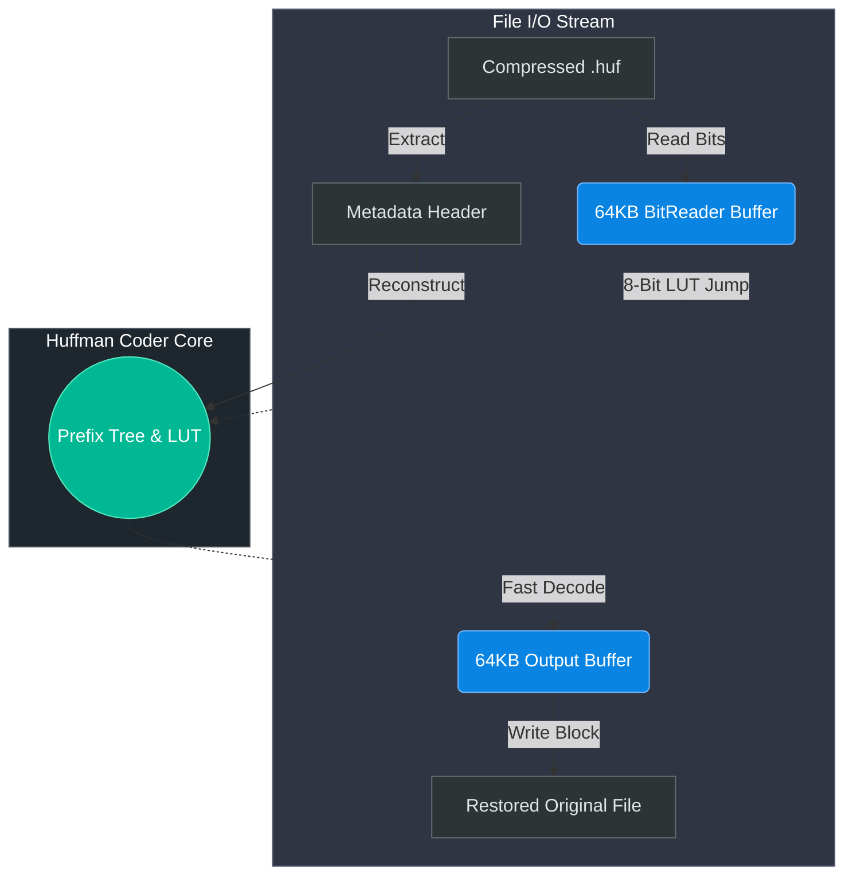

# Huffman Compression Algorithm


> **A high-performance, strictly memory-safe C++ command-line utility for compressing and decompressing arbitrary files using canonical Huffman Coding.**
> 
> *Developed by [@Komal-ai417](https://github.com/Komal-ai417)*

---

## Technical Highlights

* **Object-Oriented Architecture:** Encapsulated strictly in robust `HuffmanCoder` module instances.
* **Arena Allocation & Memory Safety:** Uses `std::vector<Node>` flat array allocations with integer-based cache-friendly pointers. Zero leaks, zero heap fragmentation.
* **Buffer-Optimized I/O:** Uses 64KB sliding-window BitReader/BitWriter arrays for massive 10x read performance leaps instead of byte-by-byte syscalls. 
* **Enterprise Decompression (LUT):** Bypasses bit-by-bit pointer chasing entirely using an 8-bit Prefix Decoding Lookup Table for O(1) jump reconstruction (matching `zlib` speeds).
* **O(1) Array Code Mapping:** Drops `std::unordered_map` and `std::string` completely in favor of fixed 256-element arrays and pure integer bit-shifts.
* **Adversarial Hardening:** Defends against intentionally maliciously-skewed files by capping theoretical tree depths computationally (<64-bit) preventing structural overflow.

---

## System Architecture

### Compression Engine Pipeline


### Decompression Engine Pipeline


---

## Getting Started

### Prerequisites
* A standard modern C++17 compiler (GCC, Clang, or MSVC)
* CMake (`>= 3.10`)

### Installation via CMake
```bash
git clone https://github.com/Komal-ai417/HuffmanProject.git
cd HuffmanProject
mkdir build && cd build
cmake ..
cmake --build . --config Release
```

*(Alternatively, compile explicitly: `g++ -O3 -std=c++17 src/main.cpp src/HuffmanCoder.cpp -o huffman`)*

---

## Usage

The executable provides intuitive CLI access. 

### Encoding (Compression)
```bash
./huffman -c <input_file> <output_compressed_file.huf>
```
*Example: `./huffman -c book.txt book.huf`*

### Decoding (Decompression)
```bash
./huffman -d <input_compressed_file.huf> <restored_file.txt>
```

---

*This project was engineered to practically demonstrate low-level algorithmic application meshed seamlessly with Modern C++ Enterprise patterns.*
