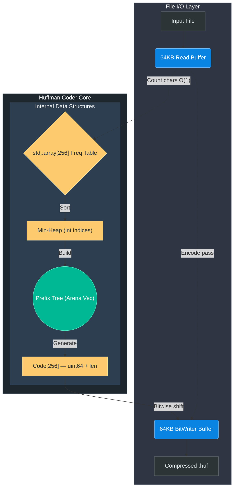
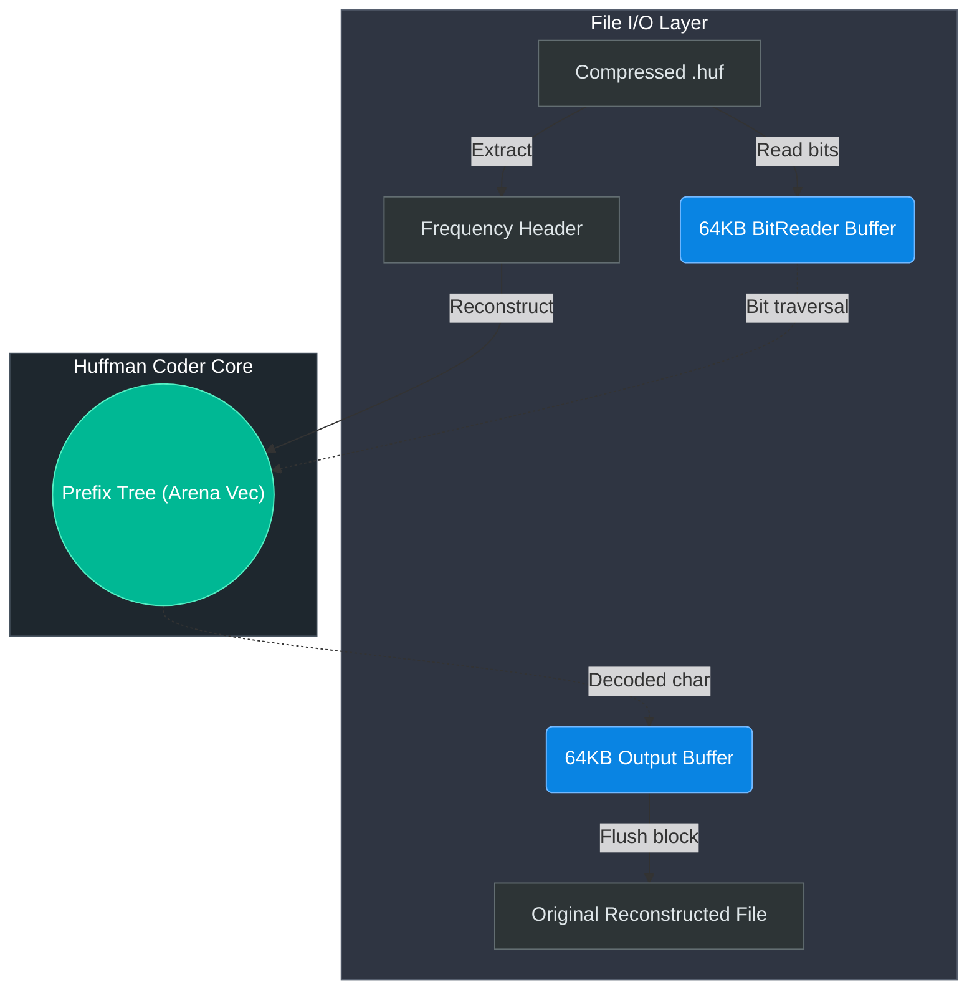

<h1 align="center">🗜️ Huffman Compression Engine</h1>

<p align="center">
  
  
  
  
  
</p>

<p align="center">
  <b>A high-performance, lossless file compression utility built in modern C++17.</b><br/>
  Implements the canonical Huffman Coding algorithm with enterprise-grade optimisations —<br/>
  arena-allocated trees, O(1) frequency lookup, and integer bitwise code emission.
</p>

<p align="center">
  <i>Developed by <a href="https://github.com/Komal-ai417">@Komal-ai417</a></i>
</p>

---

## 📖 Table of Contents

- [About the Algorithm](#-about-the-algorithm)
- [Performance Optimisations](#-performance-optimisations)
- [System Architecture](#️-system-architecture)
- [Project Structure](#-project-structure)
- [Getting Started](#-getting-started)
- [Usage](#-usage)
- [CI / Testing](#-ci--testing)
- [Edge Cases Handled](#-edge-cases-handled)

---

## 🧮 About the Algorithm

**Huffman Coding** is an optimal prefix-free lossless compression algorithm invented by David A. Huffman in 1952. It assigns shorter binary codes to more frequent characters and longer codes to rarer ones — minimising the total number of bits required to represent a file.

```
Character frequencies → Min-Heap → Prefix Tree → Variable-length Bit Codes → Compressed bitstream
```

The compressed `.huf` file embeds a compact frequency table header, making it **fully self-contained** — decompression requires only the `.huf` file itself.

---

## ⚡ Performance Optimisations

Every hot path has been deliberately optimised beyond a naive implementation:

| Optimisation | Technique | Benefit |
|---|---|---|
| **Frequency Table** | `std::array<uint64_t, 256>` instead of `unordered_map` | O(1) direct index lookup, zero hashing, zero allocations |
| **Tree Storage** | Flat `std::vector<Node>` with `int` child indices (arena allocation) | All 511 nodes contiguous in RAM — eliminates heap scatter and CPU cache misses |
| **Bit Code Emission** | `uint64_t bits` + `uint8_t length` struct + bitwise shift | Entire codeword written in one CPU operation, no per-character string loop |
| **64-bit Shift Register** | `BitWriter` accumulates up to 64 bits before flushing | Drastically fewer branch evaluations in the encoding hot loop |
| **64KB I/O Buffering** | `BitWriter`, `BitReader`, and decompression output all use 64KB buffers | Minimises syscall overhead across all file access paths |
| **EOF Bug Fixed** | `while(true) { read; if(gcount==0) break; }` pattern | Prevents silent double-processing of the final partial file chunk |
| **Deterministic Trees** | Sorted character insertion + freq/char tie-breaking | Identical tree on every platform and compiler, guaranteed |

---

## ⚙️ System Architecture

### 📥 Compression Pipeline



### 📤 Decompression Pipeline



---

## 📁 Project Structure

```
HuffmanProject/
├── .github/
│   └── workflows/
│       └── ci.yml          # Cross-platform CI (Ubuntu · Windows · macOS)
├── src/
│   ├── HuffmanCoder.h      # Class declaration — Node, Code structs, public API
│   ├── HuffmanCoder.cpp    # Core algorithm — tree, encoding, decoding
│   └── main.cpp            # CLI entry point
├── tests/
│   └── test_huffman.cpp    # Self-contained data-integrity test suite
├── .gitignore
├── CMakeLists.txt           # CMake build system with CTest integration
└── README.md
```

---

## 🚀 Getting Started

### Prerequisites
- C++17 compiler: **GCC ≥ 7**, **Clang ≥ 5**, or **MSVC ≥ 2017**
- **CMake ≥ 3.10**

### Build via CMake (Recommended)

```bash
git clone https://github.com/Komal-ai417/HuffmanProject.git
cd HuffmanProject
mkdir build && cd build
cmake .. -DCMAKE_BUILD_TYPE=Release
cmake --build . --config Release
```

### Build directly with g++

```bash
g++ -O3 -std=c++17 src/main.cpp src/HuffmanCoder.cpp -o huffman
```

---

## 💻 Usage

### Compress a file
```bash
./huffman -c <input_file> <output_file.huf>
```
```bash
# Examples
./huffman -c document.txt   document.huf
./huffman -c image.png      image.huf
./huffman -c archive.tar    archive.huf
```

### Decompress a file
```bash
./huffman -d <input_file.huf> <output_file>
```
```bash
./huffman -d document.huf   document_restored.txt
```

> **The decompressed file is a bit-for-bit exact copy of the original.** All tests verify this with SHA-256 hash comparison.

---

## 🧪 CI / Testing

A GitHub Actions workflow automatically builds and runs the test suite on **three platforms** for every push and pull request:

```yaml
matrix:
  os: [ubuntu-latest, windows-latest, macos-latest]
```

The test suite (`tests/test_huffman.cpp`) covers:

| Test Case | Validates |
|---|---|
| Standard text file | Normal variable-length encoding round-trip |
| Empty file (0 bytes) | Graceful no-op compression and decompression |
| Single repeated character | Edge case — coefficient codes for homogeneous data |
| Large binary blob | Correct handling of all 256 byte values |

---

## 🛡️ Edge Cases Handled

- **Empty file** — header written with `totalChars = 0`; decompression immediately produces an empty output file
- **Single unique character** — no bitstream is written during compression; decompression reconstructs by repeating the character `freq` times
- **All 256 byte values** — `unsigned char` casting ensures no signed-index overflow; verified with random 1MB binary tests
- **Arbitrary binary formats** — `.exe`, `.png`, `.zip`, and other binary files compress and restore perfectly

---

## 📄 License

This project is released under the [MIT License](LICENSE).

---

<p align="center">
  Built with ❤️ and C++17 by <a href="https://github.com/Komal-ai417">@Komal-ai417</a>
</p>
