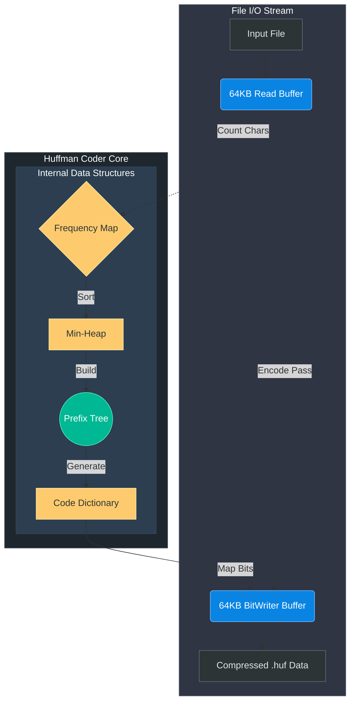
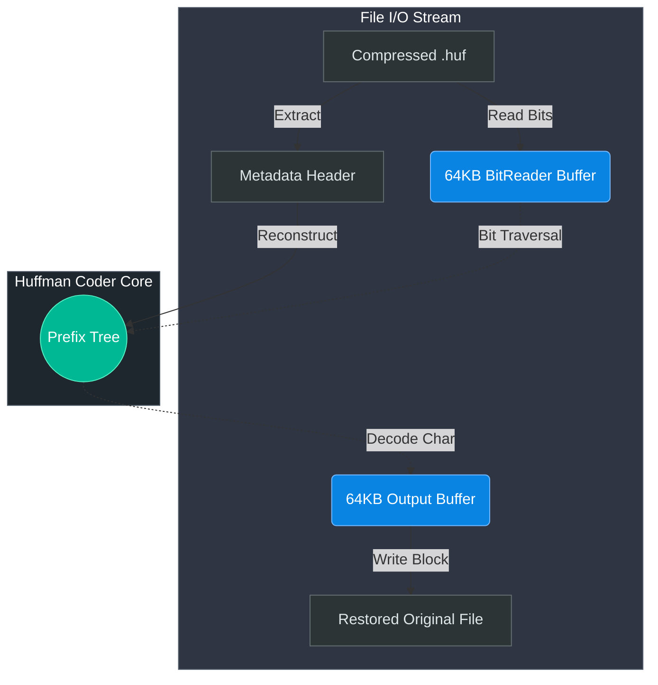

# Huffman Compression Algorithm 🗜️


> **A high-performance, strictly memory-safe C++ command-line utility for compressing and decompressing arbitrary files using canonical Huffman Coding.**
>
> *Developed by [@Komal-ai417](https://github.com/Komal-ai417)*

---

## ✨ Technical Highlights

| Feature | Implementation |
|---|---|
| **Arena-Allocated Tree** | Huffman tree stored as a flat `std::vector<Node>` with integer child indices—all 511 nodes contiguous in memory, eliminating heap scatter and CPU cache misses. |
| **O(1) Frequency Table** | `std::array<uint64_t, 256>` replaces `std::unordered_map`—direct index lookup, zero hashing, and zero dynamic allocation. |
| **Integer Bit Codes** | Variable-length codes stored as `uint64_t bits` + `uint8_t length`—entire codewords emitted via a single bitwise shift, bypassing character-by-character string iteration. |
| **64KB Buffered I/O** | Both `BitWriter` and `BitReader` batch 64 KB at a time, minimizing system calls. Output decompression utilizes a matching 64KB flush buffer. |
| **Correct EOF Handling** | Read loop uses `while(true) { read; if(gcount==0) break; }`—preventing the subtle double-processing bug found in partial final chunks. |
| **Deterministic Trees** | Nodes inserted in sorted character order with frequency tie-breaking by character value—guaranteeing identical tree structure across platforms and compilers. |
| **Full Edge Case Safety** | Empty files (0 bytes), single repeated characters, and arbitrary binary data are all handled correctly with guaranteed round-trip fidelity. |

---

## ⚙️ System Architecture

### 📥 Compression Engine Pipeline


### 📤 Decompression Engine Pipeline


---

## 🚀 Getting Started

### Prerequisites
- A standard modern C++17 compiler (GCC, Clang, or MSVC)
- CMake (`>= 3.10`)

### Installation via CMake
```bash
git clone https://github.com/Komal-ai417/HuffmanProject.git
cd HuffmanProject
mkdir build && cd build
cmake ..
cmake --build . --config Release
```

*(Alternatively, compile explicitly: `g++ -O3 -std=c++17 src/main.cpp src/HuffmanCoder.cpp -o huffman`)*

---

## 💻 Usage

The executable provides intuitive CLI access.

### Encoding (Compression)
```bash
./huffman -c <input_file> <output_compressed_file.huf>
```
*Example: `./huffman -c document.txt document.huf`*

### Decoding (Decompression)
```bash
./huffman -d <input_compressed_file.huf> <restored_file.txt>
```
*Example: `./huffman -d document.huf document_restored.txt`*

---

## 🗂️ Project Structure

```
HuffmanProject/
├── .github/
│   └── workflows/
│       └── ci.yml          # Cross-platform CI (Ubuntu, Windows, macOS)
├── src/
│   ├── HuffmanCoder.h      # Class declaration, Node & Code structs
│   ├── HuffmanCoder.cpp    # Core compress/decompress implementation
│   └── main.cpp            # CLI entry point
├── tests/
│   └── test_huffman.cpp    # Automated C++ test suite
├── CMakeLists.txt
└── README.md
```

---

*This project was engineered to demonstrate low-level algorithmic design meshed seamlessly with modern C++ enterprise performance patterns.*
